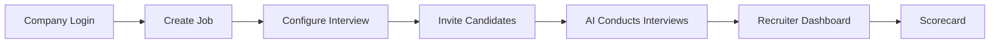
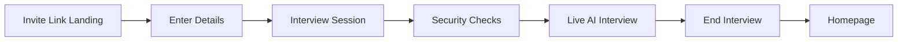

# Uhired — User Journey Design Document (DD)

**Version:** 1.0  
**Date:** August 7, 2026  
**Status:** Implemented (with notes below)

---

## 1. Purpose

This document describes the end-to-end user journeys for **Recruiters** (Company Admin) and **Candidates** on the Uhired platform. Each step maps to existing routes, APIs, and components in the codebase.

---

## 2. Journey A — Recruiter (Company Admin)

### Step 1 — Company Login

| Item | Detail |
|------|--------|
| **Route** | `/company-login` |
| **Register** | `/company-register` |
| **API** | `POST /api/company-auth/login`, `POST /api/company-auth/register` |
| **Files** | `src/app/company-login/page.tsx`, `src/components/auth/admin-portal-login.tsx` |
| **Auth** | Company email + passcode → session cookie |
| **Redirect** | `/admin` (Company Admin Portal) |
| **Status** | ✅ Implemented |

**Flow:**
1. Recruiter opens `/company-login`
2. Enters company email and passcode
3. On success → redirected to `/admin`

---

### Step 2 — Create Job (Requirement)

| Item | Detail |
|------|--------|
| **Route** | `/admin` → section **Overview** |
| **API** | `POST /api/admin/requirements/invite-candidates` (creates requirement on first invite) |
| **Files** | `src/app/admin/admin-page-client.tsx` |
| **Data model** | `Requirement` (job role configuration) |
| **Status** | ✅ Implemented |

**Fields captured:**
- Target role / position title
- Job description
- Key skills (with AI suggestions)

> **Note:** Jobs are called **Requirements** in the database. There is no separate “Create Job” button — the requirement is created when the recruiter sends the first batch of invites from Overview.

---

### Step 3 — Configure Interview

| Item | Detail |
|------|--------|
| **Route** | `/admin` → section **Overview** (Step 3) or **Settings** (AI Interviewer) |
| **API** | `POST /api/ai/generate-questions`, `GET/PATCH /api/admin/company-settings` |
| **Files** | `admin-page-client.tsx`, `src/lib/interview-prompt.ts`, `src/lib/interview-duration.ts` |
| **Status** | ✅ Implemented |

**Configurable options:**
| Setting | Description |
|---------|-------------|
| Duration | 5–120 minutes |
| Language | Interview language |
| Mandatory questions | Up to 5 custom questions |
| Optional questions | Pool with max count |
| AI generation | Auto-generate questions from JD if blank |
| Interviewer voice | Male / Female (company settings) |
| Branding | Logo, display name, accent color |

---

### Step 4 — Invite Candidates

| Item | Detail |
|------|--------|
| **Route** | `/admin` → Overview sidebar |
| **API** | `POST /api/admin/requirements/invite-candidates` |
| **Files** | `src/lib/email.ts`, `src/lib/invite-delivery.ts` |
| **Status** | ✅ Implemented (requires SMTP/SES) |

**Flow:**
1. Recruiter uploads Excel or enters candidate emails manually
2. System creates `RequirementInvite` per email with unique `accessCode`
3. Email sent with link: `{baseUrl}/candidate?code={accessCode}`
4. Invite status visible in Requirements and Overview sections

**Guards:**
- Email must match invite at candidate entry
- Invite expiry enforced
- One completion per candidate per requirement

---

### Step 5 — AI Conducts Interviews

| Item | Detail |
|------|--------|
| **Candidate route** | `/interview/[sessionId]` |
| **API** | `POST /api/interview/[sessionId]/realtime`, `POST .../complete`, `POST .../video` |
| **Files** | `src/components/company-interview-room.tsx` |
| **Status** | ✅ Implemented |

**What happens (backend):**
1. Candidate verifies invite → `InterviewSession` created (status `READY`)
2. Candidate accepts consent → session goes `LIVE`
3. OpenAI Realtime WebRTC conducts voice interview
4. MediaRecorder captures webcam video
5. On end → transcript saved, scorecard generated, video uploaded

Recruiter does not need to be present — the AI interviewer runs autonomously.

---

### Step 6 — Recruiter Dashboard (Recorded Interviews)

| Item | Detail |
|------|--------|
| **Route** | `/admin` |
| **Sections** | Dashboard, Interview Sessions, Candidates, Requirements |
| **API** | `GET /api/admin/dashboard`, `GET /api/admin/sessions`, `GET /api/admin/session/[sessionId]` |
| **Files** | `src/components/admin-dashboard.tsx`, `admin-page-client.tsx` |
| **Status** | ✅ Implemented |

**Dashboard shows:**
- Total interviews, completion rate, average score
- Recent sessions with status filters
- Video recording status (`AVAILABLE` / `NOT_UPLOADED`)
- Transcript timeline per session
- View / download recording link

---

### Step 7 — Scorecard

| Item | Detail |
|------|--------|
| **Route** | `/admin` → open session detail drawer |
| **API** | `POST /api/admin/session/[sessionId]/regrade`, scorecard share APIs |
| **Public share** | `/share/scorecard/[token]` |
| **Files** | `src/lib/scoring.ts`, `src/components/scorecard-share-public.tsx` |
| **Status** | ✅ Implemented |

**Scorecard dimensions:**
- Overall score
- Communication, Domain depth, Confidence, Accuracy
- AI summary
- Per-question results (may require “Generate answer review” for async grading)

**Share options:**
- Time-limited share link
- PDF export

---

## 3. Journey B — Candidate

### Step 1 — Landing Page (Invite Link)

| Item | Detail |
|------|--------|
| **Invite URL** | `/candidate?code={accessCode}` |
| **Route** | `/candidate` |
| **Files** | `src/app/candidate/page.tsx` |
| **Status** | ✅ Implemented |

**Flow:**
1. Candidate clicks link in invite email
2. Lands on branded entry page with code pre-filled from `?code=` query param
3. Page shows secure session messaging and browser-check info cards

---

### Step 2 — Enter Candidate Details

| Item | Detail |
|------|--------|
| **Fields** | Interview code, Full name, Email |
| **API** | `POST /api/candidate/verify` |
| **Files** | `src/app/api/candidate/verify/route.ts`, `src/lib/candidate-interview-auth.ts` |
| **Status** | ✅ Implemented |

**Validation:**
- Code must match active `RequirementInvite`
- Email must match invited email
- Invite not expired
- Session not already completed

**On success:** HTTP-only session cookie set → redirect to `/interview/{sessionId}`

---

### Step 3 — Interview Session Screen

| Item | Detail |
|------|--------|
| **Route** | `/interview/[sessionId]` |
| **Component** | `CompanyInterviewRoom` |
| **API** | `GET /api/interview/[sessionId]/details` |
| **Status** | ✅ Implemented |

**Stages:** `preflight` → `connecting` → `live` → `ending` → `post`

---

### Step 4 — Security Checks & Start Interview

| Check | Location | Status |
|-------|----------|--------|
| Consent checkbox | Preflight UI | ✅ |
| Consent API persistence | `POST .../consent` | ✅ |
| Camera & mic permission | `getUserMedia()` | ✅ |
| Device check button | Preflight | ✅ |
| Camera must stay on | Live guard | ✅ |
| Face visibility detection | Live guard | ✅ |
| Pause if cam/mic disabled | Live overlay | ✅ |

> **Note:** “Browser Check” cards on `/candidate` are informational. Actual device and security checks run in the interview room preflight before “Start Interview”.

---

### Step 5 — Live AI Interview

| Item | Detail |
|------|--------|
| **Technology** | OpenAI Realtime (WebRTC voice) |
| **Recording** | Webcam video via MediaRecorder → S3/local storage |
| **Timer** | Countdown based on configured duration |
| **Status** | ✅ Implemented |

**End triggers:**
- Candidate clicks “End Interview”
- Timer expires
- Connection lost

---

### Step 6 — End Interview → Homepage

| Item | Detail |
|------|--------|
| **API** | `POST /api/interview/[sessionId]/complete` |
| **Post-interview UI** | Thank-you screen in `company-interview-room.tsx` |
| **Redirect** | `/` (marketing homepage) |
| **Status** | ✅ Implemented |

**On complete:**
1. Session marked `COMPLETED`
2. Scorecard generated for recruiter
3. Video upload finishes in background
4. Candidate sees thank-you message
5. “Close” button (or auto-redirect) takes candidate to homepage `/`

---

## 4. Route Reference (Quick Lookup)

| User action | URL / API |
|-------------|-----------|
| Company login | `/company-login` |
| Admin portal | `/admin` |
| Candidate invite link | `/candidate?code=...` |
| Interview room | `/interview/{sessionId}` |
| Marketing homepage | `/` |
| Public scorecard share | `/share/scorecard/{token}` |

---

## 5. Implementation Status Summary

| Journey step | Status | Notes |
|--------------|--------|-------|
| A1 Company Login | ✅ Done | SSO behind Phase 7b flag |
| A2 Create Job | ✅ Done | Called “Requirement” in DB |
| A3 Configure Interview | ✅ Done | — |
| A4 Invite Candidates | ✅ Done | Needs email provider configured |
| A5 AI Interviews | ✅ Done | Needs OpenAI + video storage env |
| A6 Recruiter Dashboard | ✅ Done | Video opens in new tab |
| A7 Scorecard | ✅ Done | Async per-question grading optional |
| B1 Invite landing | ✅ Done | Same page as entry form |
| B2 Enter details | ✅ Done | Email match, no OTP |
| B3 Interview session | ✅ Done | — |
| B4 Security checks | ✅ Done | In interview preflight |
| B5 Live interview | ✅ Done | — |
| B6 End → Homepage | ✅ Done | Redirects to `/` |

---

## 6. Environment Dependencies

| Feature | Required env / service |
|---------|------------------------|
| Company auth | Database (Prisma) |
| Invite emails | SMTP or AWS SES |
| AI interview | `OPENAI_API_KEY` |
| Video recording | S3 or local storage config |
| Session cookie guard | `CANDIDATE_INTERVIEW_SESSION_SECRET` (optional) |

---

## 7. Future Enhancements (Out of Current Scope)

- Dedicated branded invite landing page per company
- Browser compatibility pre-check on `/candidate` before form submit
- Email OTP verification at candidate entry
- Embedded video player in recruiter dashboard
- SSO / OIDC for company login (Phase 7b)

---

## 8. Test Checklist

### Recruiter flow
- [ ] Register company at `/company-register`
- [ ] Login at `/company-login` → lands on `/admin`
- [ ] Fill Overview: role, JD, skills, duration, questions
- [ ] Invite candidate email → receive invite with code
- [ ] After candidate completes → session appears in Interview Sessions
- [ ] Open session → view scorecard, transcript, recording link
- [ ] Create share link → open `/share/scorecard/{token}`

### Candidate flow
- [ ] Open `/candidate?code={code}` from email
- [ ] Enter name + matching email → redirect to interview
- [ ] Complete preflight: consent + camera/mic check
- [ ] Complete live interview
- [ ] Thank-you screen → Close → lands on `/`
